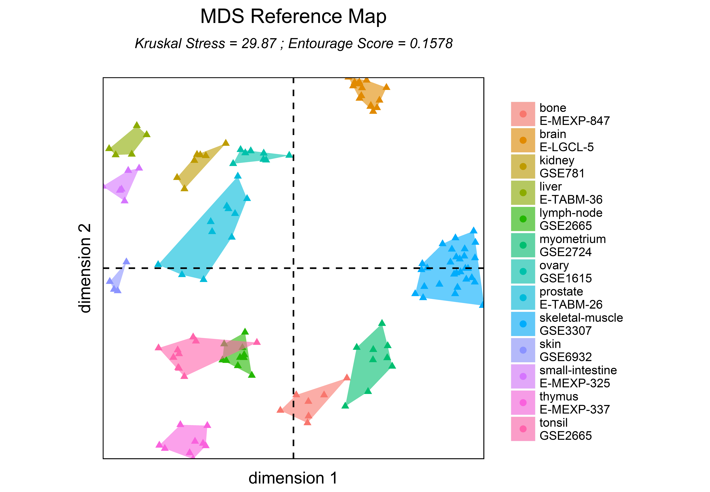
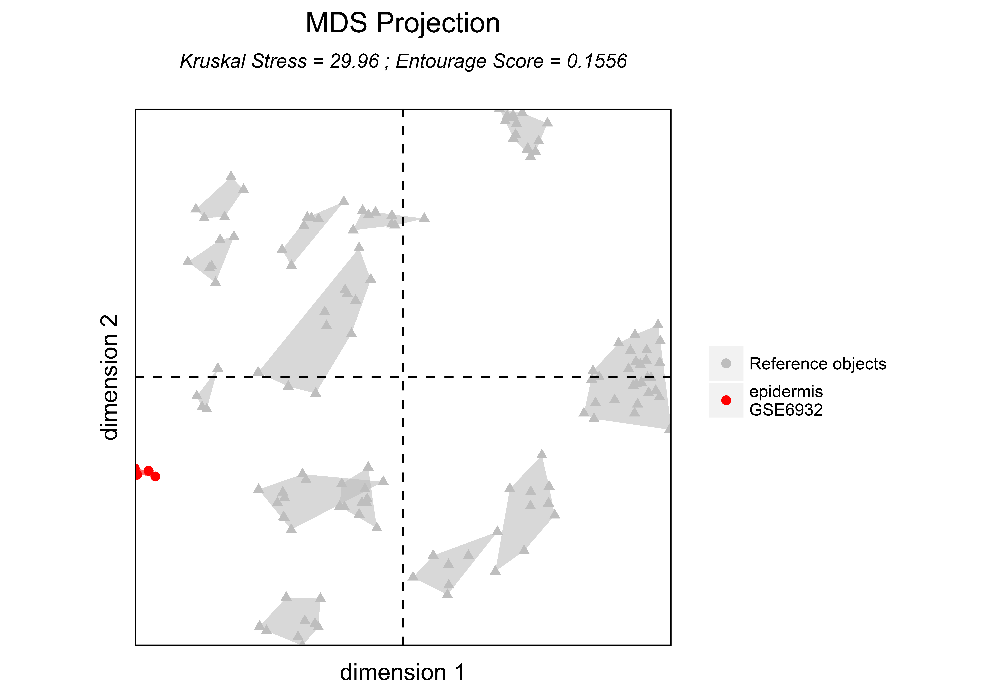
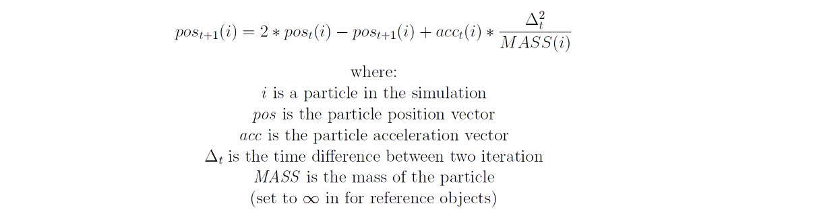
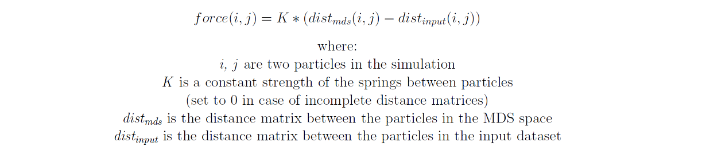
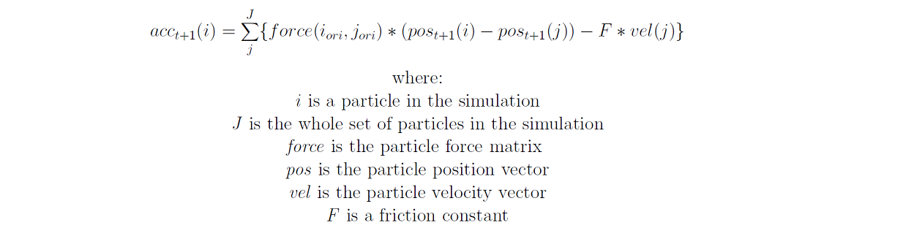

# MDSRefMaps: an R Package for Multidimensional Scaling Reference Maps and Projections


Multidimensional Scaling (MDS) is one of the most powerful method to analysis high-dimensional objects.
Such methods aim to project the similarities between high-dimensional objects into a space having a low number of dimensions, generally in two or three dimensions for visualization purpose.
Applied to 'omics' datasets, these methods allow visualizing the homogeneity of samples within different biological conditions or visualizing the similarities between gene or protein expression patterns.
In the context of complex studies, multiple MDS representations can be generated and compared to analyze and interpret the high-dimensional objects. 
However, the comparisons of different MDS representations can be difficult because of the lack of a common structure. 

We present an R package, named MDSRefMaps, allowing the projection of additional high-dimensional objects over a predefined MDS representation.
The predefined representation is named a MDS Reference Map, and the resulting projection representations are named MDS Projections.
Thanks to the common structure of the Reference Map, the comparisons between the different MDS Projections can be easily done.

# Table of Contents

1. [Package overview](#package_overview)
2. [Package installation](#package_installation)
3. [Construction of MDS Reference Maps and MDS Projections](#visualization_insilico)
    1. [Construction of MDS Reference Maps](#visualization_insilico_reference)
    2. [Construction of MDS Projections](#visualization_insilico_projections)
    3. [Construction of MDS Projections over other representations](#visualization_insilico_projectionsbis)
4. [Case studies with transcriptomic datasets](#visualization_in_vivo)
    1. [Case study with the Human Gene Expression - Global Map blood dataset](#hga_blood)
    2. [Case study with the Human Gene Expression - Global Map tissue dataset](#hga_tissue)
    3. [Case study with the MOuse NOn Coding Lung dataset](#monocl)
5. [Algorithm details](#algorithm)
6. [References](#references)

# <a name="package_overview"/> 1. Package overview
High-throughput biological data, such as 'omics' experiments, are complex to analyze due to the large number of features measured and due to the large number of samples.
Indeed, in the context of transcriptomic or proteomic studies, each profile corresponds to thousands of different gene or protein measurements.
Heatmaps [1], hierarchical clusterings [2], Principal Component Analysis [3] and Multidimensional Scaling representation [4] are among the most popular and powerful analysis tools but are limited in the context of large datasets.
Developing new visualization tools is then crucial to better interpret large biological datasets [5].

Dimensionality reduction methods perform a projection of the high-dimensional objects into a lower dimensional space, generally in order to visualize them.
Applied to biological studies, the objects can be biological samples, for which we want to understand the effect of specific treatments.
Objects can also be the genes or other biological variables, for which we want to understand the overall genomic organization or expression.

Multidimensional Scaling (MDS) is one of the most popular dimensionality reduction methods [4].
In MDS representations, the distances between the dots are proportional to the distances between the objects.
The Kruskal Stress quantifies the information lost in the dimensionality reduction process.

We previously published a multidimensional scaling method, named SVD-MDS, which is based on a molecular dynamic approach [8].
In our approach, each high-dimensional object is modeled by a particle and the distance between the objects are modeled by attractive or repulsive forces between the particles.
Moreover, the SVD-MDS algorithm uses a SVD algorithm to initialize the MDS representation and to enhances then the quality of the resulting MDS representation.
In order to quantify the local structure conservation of an MDS representation, we have proposed the Entourage Score, which is proportional to the number of common nearest neighbors between objects in the original dataset and in the resulting representation.

Comparison between the different MDS representations can be difficult because of the absence of a common structure.
We present here a new algorithm, named MDSRefMaps, which allows projecting additional high-dimensional objects over a predefined MDS representation.
The predefined representations are named MDS Reference Maps and the resulting MDS representations are named MDS Projections.
This strategy has been previously proposed in a transcriptomic study of mouse lung responses to different respiratory viruses [10].

In this tutorial, we illustrate the capability of our R package using two public available datasets: (i) the Human Gene Expression - Global Map (HGE-GM) [13] dataset; and (ii) the Mouse Non-Code Lung (MONOCL) dataset [11].
We show here that MDS Projections of different objects can be easily compared while this is impossible for regular MDS representations.
The HGE-GM dataset is composed of microarray transcriptomic profiles obtained from different human tissues to construct a global human gene expression map.
Lukk et al. collected the transcriptomic profiles from 5,372 human samples, in different tissue types, disease states and cell lines.
The MONOCL dataset is composed of RNA-seq transcriptomic profiles obtained from lungs of eight different mouse species, infected by respiratory viruses (Influenza A and SARS-CoV).
The long non-coding RNAs have been studied with overall 5,000 differentially expressed lncRNAs and 6,000 differentially expressed coding RNAs after infection.
Those transcriptomic data are available in the supplementary materials associated papers and are also available on a public FTP server: [ftp://ftp.mdsrefmaps.org/public/](ftp://ftp.mdsrefmaps.org/public/) (username: mdsrefmaps, password: mdsrefmaps).

# <a name="package_installation"/> 2. Package installation
The `ggplot2`, `Rcpp`, and `plyr` R packages are required for running MDSRefMaps.

These packages can be installed using the following commands:

```r
install.packages("ggplot2")
install.packages("Rcpp")
install.packages("plyr")
```

MDSRefMaps is available on [GitHub](https://github.com), at [https://github.com/tchitchek-lab/MDSRefMaps](https://github.com/tchitchek-lab/MDSRefMaps).
Its installation can be done via the `devtools` package using the following commands:

```r
install.packages("devtools")
library("devtools")
install_github("tchitchek-lab/MDSRefMaps")
```

Once installed, the MDSRefMaps package can be loaded using the following command:

```r
library("MDSRefMaps")
```


# <a name="visualization_insilico"/> 3. Construction of MDS Reference Maps and MDS Projections
## <a name="visualization_insilico_reference"/> 3.1 Construction of MDS Reference Maps
A MDS Reference Map basically consists on a regular MDS representation generated on set of reference objects.
In the context of 'omics' studies, these objects can be either the samples or the biological variables (genes, proteins, ...).

The `MDSReferenceMap()` function computes a MDS Reference Map based on a distance matrix provided by the user.
The parameter `k` can be used to specify the number of dimensions of the resulting MDS representation (k=2 by default).
Moreover, the MDS representation can be generated using the Euclidean and Manhattan metrics (specified via the parameter `method`).

For instance, an example MDS Reference Map can be generated using the following commands:

```r
# we will create two sets of 100 objects in a 10-dimentional space
n_obj = 100
n_atr = 10

# the first set of objects is distributed around a normal distribution
# having a mean of 0 and standard deviation of 2
obj_ref1 = matrix(rnorm(n_obj * n_atr, 0, 2), n_obj, n_atr)
# the second set of objects is distributed around a normal distribution
# having a mean of 10 and standard deviation of 2
obj_ref2 = matrix(rnorm(n_obj * n_atr, 10, 2), n_obj, n_atr)

# computes a distance matrix based on these objects
dist_ref = dist(rbind(obj_ref1, obj_ref2))

# generates a MDS Reference Map based on this distance matrix
map_ref = MDSReferenceMap(dist_ref)
```

The `MDSReferenceMap()` function returns a list of three elements:

* the `points` element is a numeric matrix contains the positions of the objects in the MDS representation
* the `stress` element is a numeric value contains the Kruskal Stress of the MDS representation
* the `entourage` element is a numeric value contains the Entourage Score of the MDS representation


```r
# prints the structure content of the MDS Reference Map
print(str(map_ref))
```

```
## List of 3
##  $ points   : num [1:200, 1:2] 9.73 12.22 13.19 11.34 16.43 ...
##  $ stress   : num 11.5
##  $ entourage: num 0.122
## NULL
```

This MDS Reference Map can be plotted, via the `plotMDS()` function, using the following commands:

```r
# plots the MDS Reference Map
plotMDS(map_ref, title = "MDS Reference Map")
```


The `plotMDS()` function can be parametrized to define colors and shapes of the dots:

```r
# defines the colors and the shapes of the dots in the MDS representation
color = c(rep("Reference set 1", n_obj), rep("Reference set 2", n_obj))
shape = c(rep("filledtrianglepointup", n_obj * 2))

# plots the MDS Reference Map with colored and shaped dots
plotMDS(map_ref, color = color, shape = shape, title = "MDS Reference Map")
```


## <a name="visualization_insilico_projections"/> 3.2 Construction of MDS Projections
A MDS Projection is an MDS Reference Map overlayed with additional objects.  
Points of the MDS Reference Map remain fixed, while the new objects are positioned regarding  theirs distances with all objects.

The `MDSProjection()` function computes a MDS Projection based on a MDS Reference Map and a distance matrix. 
The distance matrix must contain all pairwise distances between the reference and projected objects.

For instance, a MDS Projection over the previously defined MDS Reference Map can be generated using the following commands:

```r
# we will create one set of 20 new objects in a 10-dimentional space
n_objproj = 20
n_atr = 10

# this set of objects is distributed around a normal distribution having a
# mean of 0 and standard deviation of 1.5
obj_proj = matrix(rnorm(n_objproj * n_atr, 0, 1.5), n_objproj, n_atr)
# generates a distance matrix based on these reference objects and the
# additional objects
dist_refproj = dist(rbind(obj_ref1, obj_ref2, obj_proj))

# generates a MDS Projection based on this distance matrix
map_refproj = MDSProjection(map_ref, dist_refproj)

# plots the MDS Projection
color = c(rep("Reference", n_obj * 2), rep("Projection", n_objproj))
shape = c(rep("filledtrianglepointup", n_obj * 2), rep("solidcircle", n_objproj))
plotMDS(map_refproj, color = color, shape = shape, title = "MDS Projection")
```


Multiple MDS Projections can be generated over this MDS Reference Map.


MDS Reference Map and MDS Projections on synthetic data. (A) MDS Reference Map generated based on two sets of 100 objects normally distributed on two different locations (a normal distribution having a mean of 10 and a standard deviation of 2, and a normal distribution having a mean of 0 and a standard deviation of 2). (B) MDS Projection based on a set of 10 objects normally distributed with a mean of 0 and standard deviation of 1.5. (C) MDS Projection based on a set of 10 objects normally distributed with a mean of 10 and standard deviation of 1.5. (D) MDS Projection based on a set of 10 objects normally distributed with a mean of 15 and standard deviation of 1.5.


## <a name="visualization_insilico_projectionsbis"/> 3.3 Construction of MDS Projections over other representations
It is to note that the `MDSProjection()` function takes as input a dataframe providing the positions of reference objects.
Hence, it is possible to provide to this function the object positions obtained from PCA and SVD computations or from other dimensionality reduction algorithms.

For instance, a MDS Projection over the PCA representation can be generated using the following commands:

```r
# we will create two sets of 100 objects in a 10-dimentional space
n_obj = 100
n_atr = 10

# the first set of objects is distributed around a normal distribution
# having a mean of 0 and standard deviation of 2
obj_ref1 = matrix(rnorm(n_obj * n_atr, 0, 2), n_obj, n_atr)
# the second set of objects is distributed around a normal distribution
# having a mean of 10 and standard deviation of 2
obj_ref2 = matrix(rnorm(n_obj * n_atr, 10, 2), n_obj, n_atr)

# combines these sets of objects
obj = rbind(obj_ref1, obj_ref2)

# performs a PCA computation
pca <- prcomp(obj, center = FALSE, scale. = FALSE)

# creates a Reference Map based on the PCA results
refmap <- list(points = pca$x[, 1:2], stress = NA, entourage = NA)

# creates a set of new objects with a distance matrix
n_objproj = 10
n_atr = 2
obj_proj = matrix(rnorm(n_objproj * n_atr, 0, 1.5), n_objproj, n_atr)
dist_refproj = dist(rbind(refmap$points, obj_proj))

# generates a MDS Projection based on the previously defined MDS Reference
# Map
map_refproj = MDSProjection(refmap, dist_refproj)

# plots the MDS Projection
color = c(rep("Reference PCA", n_obj * 2), rep("new objects", n_objproj))
shape = c(rep("filledtrianglepointup", n_obj * 2), rep("solidcircle", n_objproj))
plotMDS(map_refproj, color = color, shape = shape, title = "MDS Projection")
```


# <a name="visualization_in_vivo"/> 4. Case studies with transcriptomic datasets

## <a name="hga_blood"/> 4.1 Case study with the Human Gene Expression - Global Map Atlas blood dataset
The Human Gene Expression - Global Map dataset [13] consists on more than 5,000 transcriptomic profiles obtained samples obtained from blood, brain or tissue human samples. 
Those samples have been collected on different conditions and disease states.

Here, we illustrate the MDSRefMaps paradigm using a subset of the Human Gene Expression - Global Map, consisting on samples from blood cells. 

This dataset can be loaded using the following commands:

```r
# loads the HGE-GM blood dataset
load("HGA-blood_refproj.Rdata")
load("HGA-blood_aes.Rdata")

# retrieves the expression data and aesthetics
data_ref = data_HGA_BLOOD_ref
data_refproj = data_HGA_BLOOD_refproj
aes_ref = HGA_BLOOD_aes_ref
aes_refproj = HGA_BLOOD_aes_refproj
```


A MDS Reference Map can be generated using the following commands:

```r
dist = distEuclidean(as.matrix(data_ref))
ref = MDSReferenceMap(dist)
plotMDS(ref, aes_ref$color, aes_ref$shape, aes_ref$color, title = "MDS Reference Map")
```


A MDS Projection, containing additional blood samples, can be generated using the following commands: 

```r
# get a set of profiles to project
subset = which(aes_refproj["Tcell_E-MEXP-750"] == 1)
data_refproj_subset = data_refproj[subset, ]

# compute the ditance matrix and the MDS Projection
dist_refproj = distEuclidean(as.matrix(data_refproj_subset))
refproj = MDSProjection(ref, dist_refproj)
plotMDS(refproj, nref = nrow(aes_ref), polygon = aes_refproj$color[subset], 
    title = "MDS Projection")
```


The following figure shows the MDS Reference Map with different MDS Projections in regards to Regular isoMDS Representations.


MDS Reference Map and MDS Projections representations compared to regular isoMDS representations constructed using transcriptomic profiles of blood samples from the Human Gene Expression - Global Map dataset (Lukk et al., 2010). This dataset consists on microarray transcriptomic profiles of various types of human samples collected from multiple public datasets. Transcriptomic profiles represented in this figure are extracted from human blood cell populations (leukocytes, monocytes, PBMC, B and T cells). Panels A and B respectively correspond to a MDS Reference Map and a regular isoMDS representation constructed with a set of profiles corresponding to samples that can serve as blood sample references in the subdataset. Panels C and E correspond to MDS Projections constructed with the MDS Reference Map and additional samples. Panels D and F correspond to regular isoMDS representations constructed with in the isoMDS function of the MASS R package.

MDS Projections of different biological samples can be compared while this is impossible for regular isoMDS representations. Moreover, the Kruskal stress of the different MDS Projections are lower than the one of isoMDS representations.


## <a name="hga_tissue"/> 4.2 Case study with the Human Gene Expression - Global Map tissue dataset

Here, we illustrate the MDSRefMaps paradigm using a subset of the Human Gene Expression - Global Map, consisting on samples from tissue samples. 

The dataset is loaded with the following lines:

```r
# load the HGE-GM tissue dataset
load("HGA-tissue_refproj.Rdata")
load("HGA-tissue_aes.Rdata")

# retrieves the expression data and aesthetics
data_ref = data_HGA_TISSUE_ref
data_refproj = data_HGA_TISSUE_refproj
aes_ref = HGA_TISSUE_aes_ref
aes_refproj = HGA_TISSUE_aes_refproj
```

A MDS Reference Map can be generated using the following commands:

```r
dist = distEuclidean(as.matrix(data_ref))
ref = MDSReferenceMap(dist)
plotMDS(ref, aes_ref$color, aes_ref$shape, aes_ref$color, title = "MDS Reference Map")
```




A MDS Projection, containing additional tissue samples, can be generated using the following commands: 

```r
subset = which(aes_refproj["epidermis_GSE6932"] == 1)
data_refproj_subset = data_refproj[subset, ]
dist_refproj = distEuclidean(as.matrix(data_refproj_subset))
refproj = MDSProjection(ref, dist_refproj)
plotMDS(refproj, nref = nrow(aes_ref), polygon = aes_refproj$color[subset], 
    title = "MDS Projection")
```



The following figure shows the MDS Reference Map with different MDS Projections in regard to Regular isoMDS Representations.


MDS Reference Map and MDS Projections representations compared to regular isoMDS representations constructed using transcriptomic profiles of blood samples from the Human Gene Expression - Global Map dataset (Lukk et al., 2010). This dataset consists on microarray transcriptomic profiles of various types of human samples collected from multiple public datasets. Transcriptomic profiles represented in this figure are extracted from tissue samples. Panels A and B respectively correspond to a MDS Reference Map and a regular isoMDS representation constructed with a set of profiles corresponding to samples that can serve as sample references in the subdataset. Panels C and E correspond to MDS Projections constructed with the MDS Reference Map and additional samples. Panels D and F correspond to regular isoMDS representations constructed with the reference and additional samples with the isoMDS function of the MASS R package.

MDS Projections of different biological samples can be compared while this is impossible for regular isoMDS representations. Moreover, the Kruskal stress of the different MDS Projections are lower than the one of isoMDS representations.


## <a name="monocl"/> 4.3 Case study with the MOuse NOn Coding Lung dataset
Here, we illustrate the MDSRefMaps algorithm using the Mouse Non-Code Lung dataset.

This dataset contains coding and non-coding genes associated with the host reponse of mouse lung to repiratory viruses (influenza and SARS).
While coding genes are well characterized and have curated functional annotations, non-coding genes are less characterized.

The MDS Reference Map will then be constructed using the coding genes, on which the non-coding genes will be projected.

This dataset can be loaded using the following commands:

```r
# loads the MONOCL dataset
load("./MONOCL_dist_refproj.Rdata")
load("./MONOCL_aes.Rdata")

# retrives the distance matrices and aesthetics parameters
dist_ref = dist_MONOCL_ref
dist_refproj = dist_MONOCL_refproj
aes_ref = MONOCL_aes_ref
aes_refproj = MONOCL_aes_refproj
```

The MDS Reference Map can be generated using the following commands:

```r
ref = MDSReferenceMap(dist_ref)
plotMDS(ref, color = aes_ref$color, shape = aes_ref$shape, title = "MDS Reference Map")
```


A MDS Projection, containing additional non-coding genes, can be generated using the following commands: 

```r
subset = which(aes_refproj["black"] == 1)
dist_refproj_subset = dist_refproj[subset, subset]
refproj = MDSProjection(ref, dist_refproj_subset)
plotMDS(refproj, color = aes_refproj$color[subset], nref = nrow(dist_ref), title = "MDS Projection")
```


A MDS Reference Map and MDS Projections representations compared to regular MDS representations constructed using mouse lung transcriptomic profiles from the MONOCL dataset (Josset et al., 2014). This dataset consists of RNA-seq transcriptomic profiles from mouse lungs infected by SARS (MA-15) or influenza (PR8) virus. This study was designed to identify long non-coding genes (~5,000 genes) associated with the host response to respiratory viruses and to annotated them based on the expression of known coding genes (~6,000 genes). A co-expression network has been constructed using the whole dataset of profiles and non-coding genes have been annotated based on the coding genes belonging to the same co-expression modules (labelled with different color names). Panels A and B correspond to a MDS Reference Map and a regular isoMDS representation constructed using the set of coding genes. Panels C, E, and G correspond to MDS Projections constructed using the coding genes of the MDS Reference Map and additional non-coding genes associated with different co-expression modules. Panels D, F and H correspond to regular isoMDS representations constructed using the coding genes of the MDS Reference Map and additional non-coding genes associated with different co-expression modules. MDS Projections shows that the non-coding genes and the coding genes belonging to the same co-expression modules have similar expression patterns and are positioned in the same locations. Regular isoMDS representations are more difficult to interpret as the coding-genes are not positioned at the same location in the different representations. 

# <a name="algorithm"/> 5. Algorithm details

Both MDS Reference Maps and MDS Projections are constructed using the Verlet algorithm. 
Our approach consists in simulating the high-dimensional objects by particles linked by repulsion and attraction forces. 
These forces are proportional to the distances between the objects.
A friction parameter is used to progressively reduce the amount of energy in the system.
At each step of the simulation, particles are moved based on the force between objects, until an equilibrium is reached.
The best MDS configuration found during the simulation, in term of Kruskal Stress, is then returned.

The Kruskal Stress is computed at each simulation step in order to know when the best object position is encountered. 
The simulation stops when the object positions are stable, that is to say when the Kruskal Stress is stable. 

The positions of the projected objects can be initialized randomly or using an SVD approach. 
The distances between objects are computed based on the Euclidean metric or and Manhattan metric. 

Several particle interaction parameters are defined in the Verlet algorithm: 

* The parameter K corresponds to the strength of spring between two particles (set to 1 by default). 
* The parameter F corresponds to the spring friction (set to 0.1 by default). 
* The parameter DELTA_T correspond to the time between each iteration (set to 0.01 by default). 
* The parameter MASS corresponds to the mass of each particle (set to 10 by default).

At each step of simulation, the following computation steps are performed:

The 1<sup>st</sup> step computes the particle positions using the following equation:




The 2<sup>nd</sup> step computes the particle velocities using the following equation:


The 3<sup>rd</sup> step computes the force between each pair of particles using the following equation:




The 4<sup>th</sup> step computes the particle accelerations using the following equation:




Finally, the 5<sup>th</sup> step computes the Kruskal Stress.

The simulation stops when the standard deviation of the Kruskal Stress is under a threshold (defined by the user).
The best MDS representation in term of Kruskal Stress is returned with its Entourage Score.

# <a name="References"/> 6. References

[1]	M. B. Eisen, P. T. Spellman, P. O. Brown, and D. Botstein, "Cluster analysis and display of genome-wide expression patterns.," Proc. Natl. Acad. Sci. U. S. A., vol. 95, no. 25, pp. 14863-8, 1998.

[2]	F. Murtagh and P. Contreras, "Methods of Hierarchical Clustering," Computer (Long. Beach. Calif)., vol. 38, no. 2, pp. 1-21, 2011.

[3]	H. Abdi and L. J. Williams, "Principal component analysis," Wiley Interdisciplinary Reviews: Computational Statistics, vol. 2, no. 4. pp. 433-459, 2010.

[4]	J. B. Kruskal, "Nonmetric multidimensional scaling: A numerical method," Psychometrika, vol. 29, no. 2, pp. 115-129, 1964.

[5]	C. Meng, B. Kuster, A. C. Culhane, and A. Gholami, "A multivariate approach to the integration of multi-omics datasets," BMC Bioinformatics, vol. 15, no. 1, p. 162, 2014.

[6]	D. Kalman, "A Singularly Valuable Decomposition: The SVD of a Matrix," Coll. Math. J., vol. 27, no. 1, pp. 2-23, 1996.

[7]	L. Lin, J. Frelinger, W. Jiang, G. Finak, C. Seshadri, P. A. Bart, G. Pantaleo, J. Mcelrath, S. Derosa, and R. Gottardo, "Identification and visualization of multidimensional antigen-specific T-cell populations in polychromatic cytometry data," Cytom. Part A, vol. 87, no. 7, pp. 675-682, 2015.

[8]	C. Bécavin, N. Tchitchek, C. Mintsa-Eya, A. Lesne, A. Benecke, "Improving the efficiency of multidimensional scaling in the analysis of high-dimensional data using singular value decomposition," Bioinformatics, vol. 27, no. 10, pp. 1413-1421, 2011.

[9]	L. Verlet, "Computer 'experiments' on classical fluids. I. Thermodynamical properties of Lennard-Jones molecules," Phys. Rev., vol. 159, no. 1, pp. 98-103, 1967.

[10]	N. Tchitchek, A. J. Eisfeld, J. Tisoncik-Go, L. Josset, L. E. Gralinski, C. Bécavin, S. C. Tilton, B.-J. Webb-Robertson, M. T. Ferris, A. L. Totura, C. Li, G. Neumann, T. O. Metz, R. D. Smith, K. M. Waters, R. Baric, Y. Kawaoka, and M. G. Katze, "Specific mutations in H5N1 mainly impact the magnitude and velocity of the host response in mice.," BMC Syst. Biol., vol. 7, p. 69, 2013.

[11]	L. Josset, N. Tchitchek, L. E. Gralinski, M. T. Ferris, A. J. Eisfeld, R. R. Green, M. J. Thomas, J. Tisoncik-Go, G. P. Schroth, Y. Kawaoka, F. Pardo-Manuel de Villena, R. S. Baric, M. T. Heise, X. Peng, M. G. Katze, F. P. Manuel de Villena, R. S. Baric, M. T. Heise, X. Peng, and M. G. Katze, "Annotation of long non-coding RNAs expressed in Collaborative Cross founder mice in response to respiratory virus infection reveals a new class of interferon-stimulated transcripts," RNA Biol., vol. 11, no. 7, pp. 875-890, 2014.

[12]	M. Andrecut, "Molecular dynamics multidimensional scaling," Phys. Lett. A, vol. 373, no. 23-24, pp. 2001-2006, 2009.

[13]	M. Lukk, M. Kapushesky, J. Nikkilä, H. Parkinson, A. Goncalves, W. Huber, E. Ukkonen, and A. Brazma, "A global map of human gene expression.," Nat. Biotechnol., vol. 28, no. 4, pp. 322-324, 2010.

[14]	W. N. Venables and B. D. Ripley, "Modern Applied Statistics with S.," Issues of Accuracy and Scale, no. March, p. 868, 2002.


